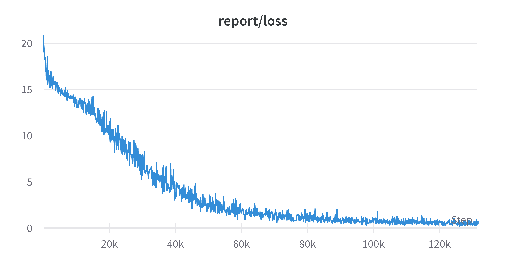
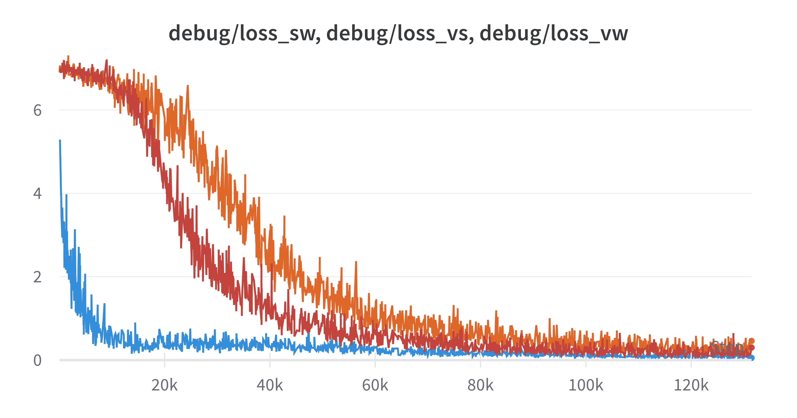

# MultimodalEmbedding

## Overview
Multimodal Self-Supervised Learning of General Audio Representations Adaptation to Californian Mouse.
Embedding space of samples are analyzed to venture on the possibilty of self-supervised clustering.

First, project focused on reproducing the model and its training code. Then, the model will be adapted accordingly to analyze Californian Mouse.

## Dataset
### Audioset
To acquire the dataset, follow instructions from [audiodl](https://github.com/speedyseal/audiosetdl).
Make required changes on `download_audioset.py` and run the following line.
```bash
python download_audioset.py ../raw_data \
    -f /usr/local/bin/ffmpeg -fp /usr/local/bin/ffprobe \
    -asr 16000 -vm bestvideo -vfr 5 -nr 2 -n 16
```
### Californian Mouse
_TBU_

Reproduction doesn't seem promising, so acquiring data specific to Californian Mouse will be postponed.

## Model
The model architecture is the same as architecture introduced in [Multimodal Self-Supervised Learning of General Audio Representations](https://arxiv.org/pdf/2104.12807.pdf). 
TSM-ResNet50 for video, Res1DNet31 for raw audio, and CNN14 for Mel of the audio.

## Installation
```bash
git clone https://github.com/MarlerLab/MultimodalEmbedding.git
cd ./MultimodalEmbedding
pip install -r requirements.txt
```

## Train
Make necessary changes in config files under `config/` directory, and run the train script.
```bash
python train.py --config_path ./config/train_config.yaml
```

## Evaluation
When model is trained on audioset's *balanced_train_segment*, loss seemed to converge.

Loss for each modality seems promising as well.


However, unfortunately, clustering on embeddings of sample data did not make sense. 
**Clustering for unseened samples were basically random.**
